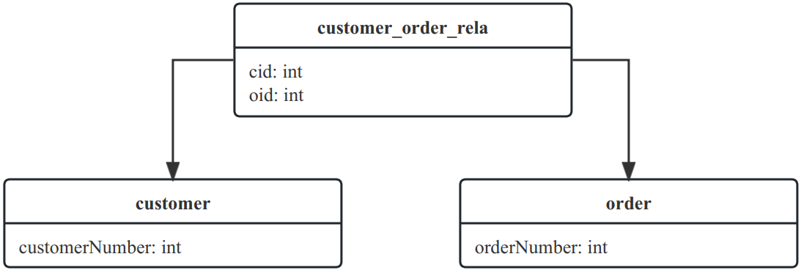

# starter-data-redis

> 官网文档

- [spring-data-jpa-docs](https://docs.spring.io/spring-data/jpa/docs/current/reference/html/#preface)
- [spring-data-jpa.html](https://docs.spring.io/spring-data/jpa/reference/jpa.html)

## JPA Repository 接口操作


接口说明：

* Repository 访问底层数据模型的超级接口，而对于某种具体的数据访问操作，则在其子接口中定义
* CrudRepository 提供了对数据的增删改查
* PagingAndSortingRepository 提供了对数据的分页和排序
* JpaRepository 最常用的，对返回值类型做了适配
* JpaSpecificationExecutor 可选的，提供多条件查询，统计查询，在查询中添加分页和排序
* QuerydslPredicateExecutor 可选的，扩展

代码示例

```java

@Repository
public interface UserRepo extends
        JpaRepository<User, String>,
        CrudRepository<User, String>,
        JpaSpecificationExecutor<User> {

    Optional<User> findByLoginName(String loginName);

    List<User> findByIdIn(List<String> ids);

    //统计查询
    long countByName(String name);

    //删除查询
    long deleteByName(String name);
}
```

## JPA 方法名命名规则(速查表)

查询方式关键词

| 关键词                                                                  | Description                                                                                                                              |
|:---------------------------------------------------------------------|:-----------------------------------------------------------------------------------------------------------------------------------------|
| `find…By`, `read…By`, `get…By`, `query…By`, `search…By`, `stream…By` | 一般查询方法通常返回存储库类型、a`Collection`或`Streamable`子类型或结果包装器（例如`Page`）`GeoResults`或任何其他特定于存储的结果包装器。可以用作`findBy…`或`findMyDomainTypeBy…`与其他关键字结合使用。 |
| `exists…By`                                                          | 存在，通常返回`boolean`结果。                                                                                                                      |
| `count…By`                                                           | 返回数字结果的计数。                                                                                                                               |
| `delete…By`, `remove…By`                                             | 删除查询方法返回不结果 ( `void`) 或删除计数。                                                                                                             |
| `…First…`, `…Top…`                                                   | 将查询结果限制为第一个``结果。该关键字可以出现在主题中`find`（以及其他关键字）和之间的任何位置`by`。                                                                                 |
| `…Distinct…`                                                         | 使用不同的查询仅返回唯一的结果。请参阅商店特定文档是否支持该功能。该关键字可以出现在主题中`find`（以及其他关键字）和之间的任何位置`by`。                                                                |

支持的查询方法谓词关键字和修饰符

| 逻辑关键字                  | 描述                  | Sample                                                                    | JPQL snippet                                                       |
|:-----------------------|---------------------|:--------------------------------------------------------------------------|:-------------------------------------------------------------------|
| `Distinct`             | 去重                  | `findDistinctByLastnameAndFirstname`                                      | `select distinct … where x.lastname = ?1 and x.firstname = ?2`     |
| `And`                  | 并且                  | `findByLastnameAndFirstname`                                              | `… where x.lastname = ?1 and x.firstname = ?2`                     |
| `Or`                   | 或                   | `findByLastnameOrFirstname`                                               | `… where x.lastname = ?1 or x.firstname = ?2`                      |
| `Is`, `Equals`         | 等于                  | `findByFirstname`,<br />`findByFirstnameIs`,<br />`findByFirstnameEquals` | `… where x.firstname = ?1`                                         |
| `Between`              | 两者之间                | `findByStartDateBetween`                                                  | `… where x.startDate between ?1 and ?2`                            |
| `LessThan`             | 小于                  | `findByAgeLessThan`                                                       | `… where x.age < ?1`                                               |
| `LessThanEqual`        | 小于等于                | `findByAgeLessThanEqual`                                                  | `… where x.age <= ?1`                                              |
| `GreaterThan`          | 大于                  | `findByAgeGreaterThan`                                                    | `… where x.age > ?1`                                               |
| `GreaterThanEqual`     | 大于等于                | `findByAgeGreaterThanEqual`                                               | `… where x.age >= ?1`                                              |
| `After`                | 之后（时间）              | `findByStartDateAfter`                                                    | `… where x.startDate > ?1`                                         |
| `Before`               | 之前（时间）              | `findByStartDateBefore`                                                   | `… where x.startDate < ?1`                                         |
| `IsNull`, `Null`       | 等于Null              | `findByAge(Is)Null`                                                       | `… where x.age is null`                                            |
| `IsNotNull`, `NotNull` | 不等于Null             | `findByAge(Is)NotNull`                                                    | `… where x.age not null`                                           |
| `Like`                 | 模糊查询。查询件中需要自己加 %    | `findByFirstnameLike`                                                     | `… where x.firstname like ?1`                                      |
| `NotLike`              | 不在模糊范围内。查询件中需要自己加 % | `findByFirstnameNotLike`                                                  | `… where x.firstname not like ?1`                                  |
| `StartingWith`         | 以某开头                | `findByFirstnameStartingWith`                                             | `… where x.firstname like ?1` (parameter bound with appended `%`)  |
| `EndingWith`           | 以某结束                | `findByFirstnameEndingWith`                                               | `… where x.firstname like ?1` (parameter bound with prepended `%`) |
| `Containing`           | 包含某                 | `findByFirstnameContaining`                                               | `… where x.firstname like ?1` (parameter bound wrapped in `%`)     |
| `OrderBy`              | 排序                  | `findByAgeOrderByLastnameDesc`                                            | `… where x.age = ?1 order by x.lastname desc`                      |
| `Not`                  | 不等于                 | `findByLastnameNot`                                                       | `… where x.lastname <> ?1`                                         |
| `In`                   | 某范围内                | `findByAgeIn(Collection ages)`                                            | `… where x.age in ?1`                                              |
| `NotIn`                | 某范围外                | `findByAgeNotIn(Collection ages)`                                         | `… where x.age not in ?1`                                          |
| `True`                 | 真                   | `findByActiveTrue()`                                                      | `… where x.active = true`                                          |
| `False`                | 假                   | `findByActiveFalse()`                                                     | `… where x.active = false`                                         |
| `IgnoreCase`           | 忽略大小写               | `findByFirstnameIgnoreCase`                                               | `… where UPPER(x.firstname) = UPPER(?1)`                           |

Q：当查询条件为null时

```shell
List findByNameAndSex(String name,String sex);
```

A：结论：当查询时传值是null时，数据库中只有该字段是null的记录才符合条件，并不是说忽略这个条件。

```shell
List findByNameAndSex(null, “男”); 
# 当 name = null时,后台生成sql片断：where (cus0_.name is null) and cus0_.sex=?
```

Q：排序规则

```shell
List findBySexOrderByName(String sex);      #名称正序（正序时，推荐此方式，简单）
List findBySexOrderByNameAsc(String sex);   #名称正序（效果同上）
List findBySexOrderByNameDesc(String sex);  #名称倒序
```

## JPA 方法的返回类型(速查表)

| Return type                        | Description                                                                                                                                 |
|:-----------------------------------|:--------------------------------------------------------------------------------------------------------------------------------------------|
| `void`                             | 表示无返回值。                                                                                                                                     |
| `Primitives`                       | Java primitives.                                                                                                                            |
| `Wrapper types`                    | Java 包装类型。                                                                                                                                  |
| `T`                                | 一个独特的实体。期望查询方法最多返回一个结果。如果没有找到结果，`null`则返回。多个结果会触发`IncorrectResultSizeDataAccessException`.                                                  |
| `Iterator`                         | An `Iterator`.                                                                                                                              |
| `Collection`                       | A `Collection`.                                                                                                                             |
| `List`                             | A `List`.                                                                                                                                   |
| `Optional`                         | Java 8 或 Guava `Optional`。期望查询方法最多返回一个结果。如果没有找到结果，`Optional.empty()`则`Optional.absent()`返回。多个结果会触发`IncorrectResultSizeDataAccessException`. |
| `Option`                           | Scala 或 Vavr`Option`类型。语义上与前面描述的 Java 8 的行为相同`Optional`。                                                                                    |
| `Stream`                           | A Java 8 `Stream`.                                                                                                                          |
| `Streamable`                       | A convenience extension of `Iterable` that directly exposes methods to stream, map and filter results, concatenate them etc.                |
| `Vavr` `Seq`, `List`, `Map`, `Set` | Vavr collection types.                                                                                                                      |
| `Future`                           | `Future`_ 需要一个方法被注解，`@Async`并且需要启用Spring的异步方法执行能力。                                                                                          |
| `CompletableFuture`                | Java 8 `CompletableFuture`. 需要一个方法被注解，`@Async`并且需要启用Spring的异步方法执行能力。                                                                        |
| `Slice`                            | 一定大小的数据块，指示是否有更多可用数据。需要一个`Pageable`方法参数。                                                                                                    |
| `Page`                             | 包含附加信息的A `Slice`，例如结果总数。需要一个`Pageable`方法参数。                                                                                                 |

## JPA 实体关系

以下注解来代表实体的关系：

* @OneToOne 代表一对一的实体关系。
* @OneToMany 代表一对多的实体关系。
* @ManyToOne 代表多对一的实体关系。
* @ManyToMany 代表多对多的实体关系。

### 一对一关系

举个例子

每个雇员都拥有一个独立的办公室，那么实体 `Employee` 和 `Office` 就是一个一对一的关系

ER 图


代码

```java
// Employee.java 雇员

@Entity
@Table(name = "employees")
@Data
public class Employee {
    @Id
    @GeneratedValue(strategy = GenerationType.IDENTITY)
    @Column(name = "employeeNumber")
    private Integer id;

    private String employeeName; //雇员名称

    @OneToOne
    @JoinColumn(name = "officeCode")
    private Office office;
}

// Office.java 办公室

@Entity
@Table(name = "offices")
@Data
public class Office {
    @Id
    @Column(name = "officeCode")
    private String code;

    private String officeName; //办公室名称
}
```

Q：怎么映射到数据库中去呢？

A：通常数据库设计时是将一张表的主键作为另一张表的外键的形式代表一对一关系的，查询时通过 `JOIN`
语句进行查询。 对应的为了可以完成对数据库表结构的映射，我们通过 `@JoinColumn` 注解并通过 `name`
指定表的外键字段名的方式，定义了在数据库的结构中如果关联到另一个实体的数据。

### 一对多关系(多对一关系)

举个例子

我们假设消费者下单的场景，那么这个情况下有两个实体：消费者 `Customer` 和订单 `Order`，并且是一对多的关系。

这种情况下，我们希望可以通过 `Customer` 实体获取到订单列表，也希望通过 `Order` 实体查询到关联的消费者。

在数据库中表示一对多关系，其实有两种情况：

* 情况一：让多的那个实体记录与另一个实体的关系
* 情况二：引入额外的表来记录两个实体之间的关联

**情况一：让多的那个实体记录与另一个实体的关系**

ER 图


代码

```java
// Customer.java 消费者

@Entity
@Table(name = "customers")
public class Customer {
    @Id
    @GeneratedValue(strategy = GenerationType.IDENTITY)
    @Column(name = "customerNumber")
    private Integer id;

    private String customerName;

    @OneToMany(mappedBy = "customer") // 一对多
    private List<Order> orders;
}

// Order.java 订单

@Entity
@Table(name = "orders")
public class Order {
    @Id
    @GeneratedValue(strategy = GenerationType.IDENTITY)
    private Integer orderNumber;

    private String orderName;

    @ManyToOne //多对一
    @JoinColumn(name = "customerNumber")
    private Customer customer;
}
```

在 `Customer` 实体中声明了 `orders` 字段，类型为 `List<Order>`，并加上了 `@OneToMany` 注解 ，通过 `mappedBy`
配置了在 `Order` 实体中的
`customer` 字段持有了关联关系。

再看 `Order` 实体，我们在 `customer` 字段上加上了 `@ManyToOne` 注解表示了和 `Customer`
实体的关系，由于关联字段在数据库表上的字段为 `customerNumber`，于是加上 `@JoinColumn` 注解在完成这个映射。

**情况二：引入额外的表来记录两个实体之间的关联**

ER 图


代码

```java
// Customer.java 消费者

@Entity
@Table(name = "customers")
public class Customer {
    @Id
    @GeneratedValue(strategy = GenerationType.IDENTITY)
    @Column(name = "customerNumber")
    private Integer id;

    @OneToMany(mappedBy = "customer") // 一对多
    @JoinTable(
            name = "customer_order_rela",
            joinColumns = @JoinColumn(name = "cid", referencedColumnName = "customerNumber"),
            inverseJoinColumns = @JoinColumn(name = "oid", referencedColumnName = "orderNumber")
    )
    private List<Order> orders;
}
```

在 `orders` 字段上加上了 `@OneToMany` 注解，通过 `@JoinTable` 注解来指定关联表以及关联表与实体表的字段映射关系。

### 多对多关系

举个例子

产品 Product 和订单 Order 就是一种多对多的关系，我们在数据库中的多对多关系通常使用额外的一张关联表来记录关联关系，这个和上面一对多关系中使用额外关联表的方式基本一致。

ER 图


代码

```java

// Product.java 产品

@Entity
@Table(name = "products")
public class Product {
    @Id
    public String productCode;

    @ManyToMany
    @JoinTable(
            name = "product_order_rela",
            joinColumns = @JoinColumn(name = "productCode", referencedColumnName = "productCode"),
            inverseJoinColumns = @JoinColumn(name = "orderNumber", referencedColumnName = "orderNumber")
    )
    public List<Order> orders;
}
```

### 关系注解详解

#### @OneToOne 注解

- `targetEntity` 关联目标实体类，指定类型后该属性可省略；
- `cascade`表示关联关系中的级联操作权限，有五种权限：
    - `CascadeType.PERSIST`：级联新增（又称级联保存）；
    - `CascadeType.MERGE`：级联合并，更新该实体时，与其有映射关系的实体也跟随更新；
    - `CascadeType.REMOVE`：级联删除，删除该实体时，与其有映射关系的实体也跟随删除；若单独删除映射关系的实体，则会抛异常;
    - `CascadeType.REFRESH`：级联刷新，该实体被操作前都会刷新，保证数据合法性；
    - `CascadeType.ALL`：包含以上四种级联操作；
- `fetch`数据加载策略，默认值为`FetchType.EAGER`：
    - `FetchType.LAZY` 表示数据获取方式为懒加载；
    - `FetchType.EAGER` 表示数据获取方式为急加载；
- `optional` 表示关联关系是否必须，默认值为`true`，`one`的一方可以为`null`；
- `mappedBy` 指定映射关系由哪一方维护，一般使用在双向映射场景；
- `orphanRemoval` 孤值删除，将会删除孤立数据，外键为null的数据将被删除；

Q：设置懒加载no Session问题解决方案有四种，推荐下面这种解决方案

```text
@OneToOne(fetch = FetchType.LAZY)
```

A：在API接口类上加上`@Transactional`注解，开启transaction的地方SESSION自然会被HOLD住。而且transaction的释放时间一定比整个HTTPREQUEST周期要短的多.

Q：设置级联删除

```text
@OneToOne(cascade = CascadeType.REMOVE) // 设置级联删除Office，若单独删除Office会报错。
```

A：级联删除，删除该实体时，与其有映射关系的实体也跟随删除；若单独删除映射关系的实体，则会抛异常

#### @OneToMany 注解

方式1：在子类中添加父类id字段

ER 图


实体类

```java

@Data
@Entity
@Table(name = "parent")
public class Parent {
    @Id
    @GeneratedValue(strategy = GenerationType.AUTO)
    private Long id;
    private String name;

    @OneToMany(mappedBy = "parent", cascade = CascadeType.ALL, orphanRemoval = true) //级联所有操作(例：级联删除)，允许独立删除Child
    private List<Child> children = new ArrayList<>();
}

@Data
@Entity
@Table(name = "child")
public class Child {
    @Id
    @GeneratedValue(strategy = GenerationType.AUTO)
    private Long id;

    private String name;

    // 外键关联，一般子实体类这边维护，因此由 Child 来关联
    //使用 Child 表关联方式，Child 表会生成一个字段，默认 parent_id
    @ManyToOne(fetch = FetchType.LAZY)
//    @JoinColumn(name = "parent_id2")
//    @JoinColumn(name = "parent_id3", referencedColumnName = "id")  // (可选地),referencedColumnName若为 Parent 主键id，则可以省略。
    private Parent parent;
}
```

单元测试

```java
public class ParentChildTest extends JpaApplicationTest {
    @Autowired
    private ParentRepo parentRepository;

    @Autowired
    private ChildRepo childRepository;

    @Test
    public void createParentWithChildren_test() {
        Parent parent = new Parent();
        parent.setName("John");

        Child child1 = new Child();
        child1.setName("Child 1");
        child1.setParent(parent);

        Child child2 = new Child();
        child2.setName("Child 2");
        child2.setParent(parent);

        parent.getChildren().add(child1);
        parent.getChildren().add(child2);

        parentRepository.save(parent);

        assertNotNull(parent.getId());
        assertNotNull(child1.getId());
        assertNotNull(child2.getId());
        assertEquals(2, parent.getChildren().size());
    }

    @Test
    public void deleteParentWithChildren_test2() {
        Parent parent = new Parent();
        parent.setName("John");

        Child child1 = new Child();
        child1.setName("Child 1");
        child1.setParent(parent);

        Child child2 = new Child();
        child2.setName("Child 2");
        child2.setParent(parent);

        parent.getChildren().add(child1);
        parent.getChildren().add(child2);

        parentRepository.save(parent);

//        parentRepository.delete(parent);

        //支持单独删除 child
        childRepository.delete(child1);
        childRepository.delete(child2);

        assertNull(childRepository.findById(child1.getId()).orElse(null));
        assertNull(childRepository.findById(child2.getId()).orElse(null));
    }
}
```

方式2：使用中间表

ER 图


实体类

```java

@Data
@Entity
@Table(name = "parent")
public class Parent {
    @Id
    @GeneratedValue(strategy = GenerationType.AUTO)
    private Long id;

    private String name;


//    @OneToMany(mappedBy = "parent", cascade = CascadeType.ALL, orphanRemoval = true)
//    private List<Child> children = new ArrayList<>();

    //注意：mappedBy 与 @JoinTable 冲突
//    @OneToMany
    @OneToMany(cascade = CascadeType.REMOVE, orphanRemoval = true) //级联删除Child，允许独立删除Child
    @JoinTable(name = "parent_childs",
            joinColumns = @JoinColumn(name = "parent_id"), //joinColumns 引用所属实体表id
            inverseJoinColumns = @JoinColumn(name = "child_id")) // inverseJoinColumns 引用所属关联表id
    private Set<Child> children = new HashSet<>();
}

@Data
@Entity
@Table(name = "child")
public class Child {
    @Id
    @GeneratedValue(strategy = GenerationType.AUTO)
    private Long id;

    private String name;
}
```

单元测试类

```java
public class ParentTest extends JpaApplicationTest {

    @Autowired
    private ParentRepo parentRepository;

    @Autowired
    private ChildRepo childRepository;

    @Test
    public void testCreateParent() {

        //先将Child对象保存到数据库中，然后再将其添加到Parent对象的children集合中。
        //否则无法保存Parent，会报错：正在尝试保存一个未持久化的实体对象
        Child child1 = new Child();
        child1.setName("Child 1");
        childRepository.save(child1);

        Child child2 = new Child();
        child2.setName("Child 2");
        childRepository.save(child2);

        Parent parent = new Parent();
        parent.setName("John");
        // Add children
        parent.getChildren().add(child1);
        parent.getChildren().add(child2);

        // Save parent and children to the database
        parentRepository.save(parent);

        assertNotNull(parent.getId());
        assertNotNull(child1.getId());
        assertNotNull(child2.getId());
        assertEquals(2, parent.getChildren().size());
    }

    @Test
    public void testDeleteParent() {
        // Create a parent to delete
        Child child1 = new Child();
        child1.setName("Child 1");
        childRepository.save(child1);

        Child child2 = new Child();
        child2.setName("Child 2");
        childRepository.save(child2);

        Parent parent = new Parent();
        parent.setName("John");
        // Add children
        parent.getChildren().add(child1);
        parent.getChildren().add(child2);

        // Save parent and children to the database
        parentRepository.save(parent);

        //不支持单独删除 child
//        childRepository.delete(child1);
//        childRepository.delete(child2);

        // Delete the parent
        parentRepository.delete(parent);

        // Assert the parent is deleted correctly
        Parent deletedParent = parentRepository.findById(parent.getId()).orElse(null);
        assertNull(deletedParent);
    }
}

```

#### @ManyToOne 注解

#### @ManyToMany 注解

## 审计功能

在字段或者方法上使用注解 `@CreatedBy`、`@LastModifiedBy`、`@CreatedDate`、`@LastModifiedDate`，当进行实体插入或者更新可以自动赋值。

注解作用：

* @CreatedDate 创建时间
* @LastModifiedDate 更新时间
* @CreatedBy 创建人
* @LastModifiedBy 更新人

> 跟踪创建和修改人，应用程序必须实现AuditorAware。     
> 仅跟踪创建和修改日期，应用程序不需要让其实体实现AuditorAware。

**1.启用审计功能(创建时间和最后修改时间)**

> 仅跟踪创建和修改日期的应用程序不需要让其实体实现AuditorAware。

```java

@EnableJpaAuditing //启动审计功能
@SpringBootApplication
public class JpaApplication {

}
```

实体类添加审计监听器 @EntityListeners(AuditingEntityListener.class)

添加创建时间、最后修改时间

```java

@Entity
@EntityListeners(AuditingEntityListener.class)
public class MyEntity {
    @Id
    private String id;
    private String username;
    private String password;

    @CreatedDate
    private LocalDateTime createTime; // 创建时间
    @LastModifiedDate
    private LocalDateTime updateTime; // 最后一次修改时间
}
```

**2.启动审计功能(创建人和最后修改人)**

添加创建人和修改人

```java

@Entity
@EntityListeners(AuditingEntityListener.class)
public class MyEntity {
    @Id
    private String id;
    private String username;
    private String password;

    @CreatedDate
    private LocalDateTime createTime; // 创建时间
    @LastModifiedDate
    private LocalDateTime updateTime; // 最后一次修改时间

    @CreatedBy
    private String createUserId;    //创建人
    @LastModifiedBy
    private String updateUserId;    //最后一次修改人
}

```

> 跟踪创建和修改人，应用程序必须实现AuditorAware。

添加 AuditorAware配置，设置默认用户

```java

@Configuration
//@EnableJpaAuditing
@EnableJpaAuditing(auditorAwareRef = "jpaAuditorAware")
public class JpaAuditorAware implements AuditorAware<String> {
    @Override
    public String getCurrentAuditor() {
        //一般从项目中security、shiro、token中获取当前登录用户
        return "userId";
    }
}
```

> 仅跟踪创建和修改日期的应用程序不需要让其实体实现AuditorAware。     
> 如果ApplicationContext中只有一个AuditorAware类型的bean，Spring-Data会自动选择，如果又多个，需要通过@EnableJpaAuditing注解的auditorAwareRef属性进行设置。

## 自定义实体监听

Auditing 是通过JPA提供的 `@EntityListeners` 和`@PrePersist`、`@PreUpdate`来完成的。

@EntityListeners 指定要用于实体或映射超类的回调侦听器类。此注释可以应用于实体类或映射的超类。属性：value，回调侦听器类。

以下注解为相应的生命周期事件指定回调方法。此注释可以应用于实体类、映射超类或回调侦听器类的方法。都是`同步机制`
使用时要注意，可以在使用时，可以在方法中`开启异步线程`或`消息队列`。

* @PrePersist 新增之前、@PostPersist 新增之后。
* @PreUpdate 更新之前、@PostUpdate 更新之后。
* @PreRemove 删除之前、@PostRemove 删除之后。
* @PostLoad 加载之后。

示例

```java

@Slf4j
@Getter
@Setter
@Entity
@Table(name = "jpa_order")
@EntityListeners(value = OrderEntityListener.class) // 添加订单实体类的监听器
public class OrderEntity extends BaseEntity {

    @Column(nullable = false)
    private int orderStatus;

    @Column(nullable = false)
    private BigDecimal price;

    /*
     * 以下方法也可以写在监听类中
     */
    @PrePersist
    public void prePersist() {
        this.setOrderStatus(1);
        log.info("orderId: {}，status :{},新增之前修改订单状态为 1", this.getId(), this.getOrderStatus());
    }

    @PostPersist
    public void postPersist() {
        log.info("orderId: {}，status :{},新增之后，异步通知仓库进行处理", this.getId(), this.getOrderStatus());
    }

    @PostLoad
    public void postLoad() {
        log.info("orderId: {}，status :{},加载之后...", this.getId(), this.getOrderStatus());
    }

    @PreUpdate
    public void preUpdate() {
        log.info("orderId: {}，status :{},修改之前.....", this.getId(), this.getOrderStatus());
    }

    @PostUpdate
    public void postUpdate() {
        log.info("orderId: {}，status :{},修改之后根据订单状态进行不同的判断", this.getId(), this.getOrderStatus());
    }

    @PreRemove
    public void preRemove() {
        log.info("orderId: {}，status :{},删除之前.....", this.getId(), this.getOrderStatus());
    }

    @PostRemove
    public void postRemove() {
        log.info("orderId: {}，status :{},删除之后.....", this.getId(), this.getOrderStatus());
    }

}
```

也可以抽出来放到监听器类中

实体监听器类

```java

@Slf4j
public class OrderEntityListener {

    @PrePersist
    public void prePersist(OrderEntity order) {
        order.setOrderStatus(1);
        log.info("orderId: {}，status :{},新增之前修改订单状态为 1", order.getId(), order.getOrderStatus());
    }

    //... ...
}
```

给实体类添加监听器

```java

@Slf4j
@Getter
@Setter
@Entity
@Table(name = "jpa_order")
@EntityListeners(value = OrderEntityListener.class) // 添加订单实体类的监听器
public class OrderEntity extends BaseEntity {

    @Column(nullable = false)
    private int orderStatus;

    @Column(nullable = false)
    private BigDecimal price;
}
```
