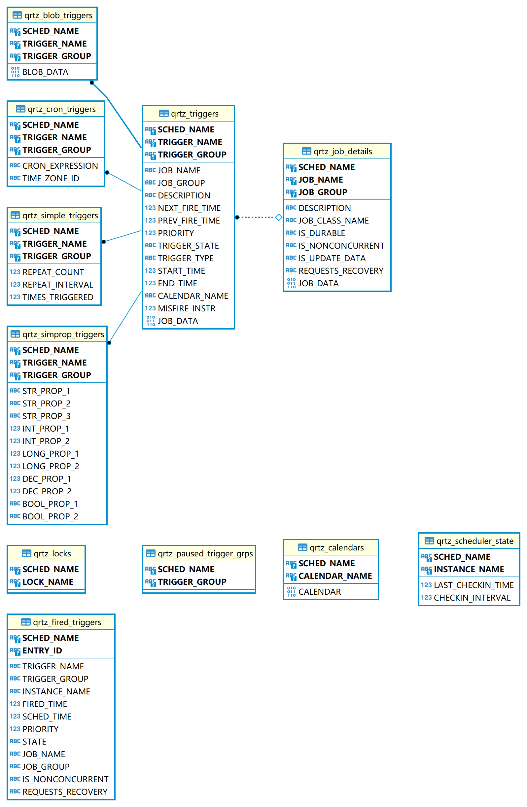

# starter-quartz-jdbc

- quartz 持久化配置


## 初始化数据库表结构

> 为了测试Quartz的持久化配置，我们事先在mysql中创建一个数据库quartz，并执行脚本，脚本藏在jdbcjobstore中有支持许多种数据库的脚本，可以按需执行。
```
org\quartz-scheduler\quartz\2.3.2\quartz-2.3.2.jar!\org\quartz\impl\jdbcjobstore\tables_mysql_innodb.sql
```

表说明
```
QRTZ_CALENDARS 以 Blob 类型存储 Quartz 的 Calendar 信息 
QRTZ_CRON_TRIGGERS 存储 Cron Trigger，包括 Cron表达式和时区信息 
QRTZ_FIRED_TRIGGERS 存储与已触发的 Trigger 相关的状态信息，以及相联 Job的执行信息 QRTZ_PAUSED_TRIGGER_GRPS 存储已暂停的 Trigger 组的信息 
QRTZ_SCHEDULER_STATE 存储少量的有关 Scheduler 的状态信息，和别的 Scheduler实例(假如是用于一个集群中) 
QRTZ_LOCKS 存储程序的悲观锁的信息(假如使用了悲观锁) 
QRTZ_JOB_DETAILS 存储每一个已配置的 Job 的详细信息 
QRTZ_JOB_LISTENERS 存储有关已配置的 JobListener 的信息 
QRTZ_SIMPLE_TRIGGERS 存储简单的Trigger，包括重复次数，间隔，以及已触的次数 
QRTZ_BLOG_TRIGGERS Trigger 作为 Blob 类型存储(用于 Quartz 用户用 JDBC创建他们自己定制的 Trigger 类型，JobStore 并不知道如何存储实例的时候) 
QRTZ_TRIGGER_LISTENERS 存储已配置的 TriggerListener 的信息 
QRTZ_TRIGGERS 存储已配置的 Trigger 的信息
```

表结构 E-R 图   

